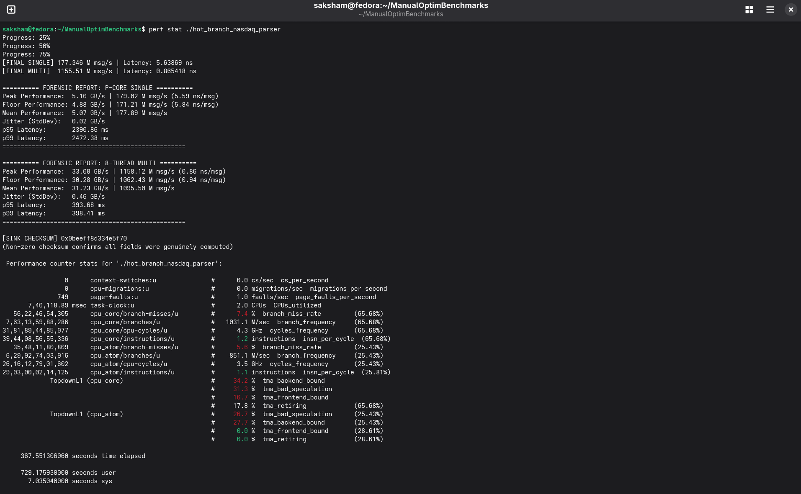
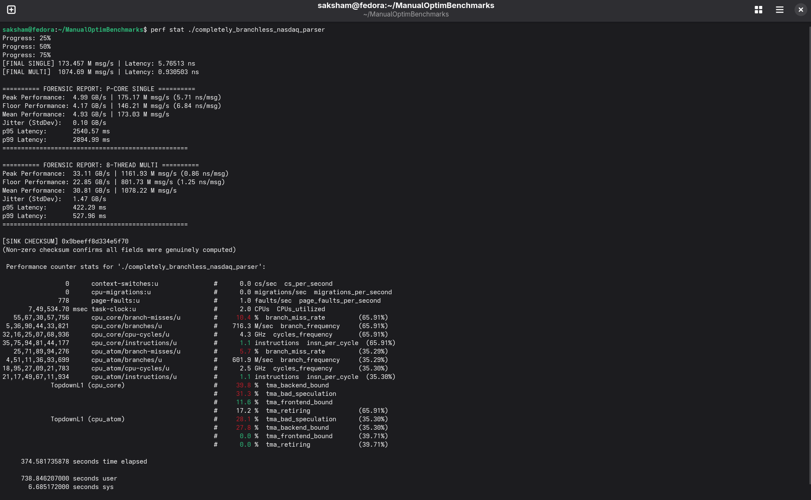

# NASDAQ ITCH 5.0 Parser — 178M msg/s Single-Core on Lunar Lake

Parses all 23 NASDAQ TotalView-ITCH 5.0 message types from a real 
12GB binary. Two competing implementations benchmarked against each other.

## Results (Intel Core Ultra 256V, Lunar Lake, 16GB LPDDR5x)

| Implementation | Single-Core | 8-Thread |
|---|---|---|
| Hybrid dispatch | ~178M msg/s | ~834M msg/s |
| Pure branchless | ~171M msg/s | ~1,091M msg/s |

Checksum: `0x9beeff8d334e5f70` (identical across both — proves correctness)

## The Interesting Finding

Hybrid wins single core. Branchless wins multi core.

The branch predictor handles one message stream easily: Add Order ('A'), 
Execute ('E'), and Trade ('P') account for ~80% of real ITCH traffic, so 
the fast-path branches are predicted near-perfectly and cost almost nothing.

Under 8-thread load, the predictor tracks 8 independent message streams 
simultaneously, prediction quality degrades, and the hybrid's fast-path 
advantage disappears. The branchless dispatch table has no branches to 
mispredict and degrades gracefully.

## Key Implementation Details

- `mmap` + `MAP_POPULATE` + `MADV_HUGEPAGE` for TLB pressure reduction
- `always_inline` for hot-path types (A, E, P), `noinline` for cold types
  to protect instruction cache
- `__builtin_bswap` + `memcpy` for zero UB big endian field extraction  
- Thread local accumulator sink flushed per run to prove liveness without
  atomic contention on the hot path
- Verified with Linux `perf stat` TMA methodology

## Build
compile any of the files with icpx and the following flags
icpx -O3 -march=native -fiopenmp -flto 

## Data

Tested on 01302020.NASDAQ_ITCH50 (12GB).
Available from NASDAQ: https://emi.nasdaq.com/ITCH/Nasdaq%20ITCH/

## Perf Results

### Hyrbrid Dispatch

### Pure Dispatch

